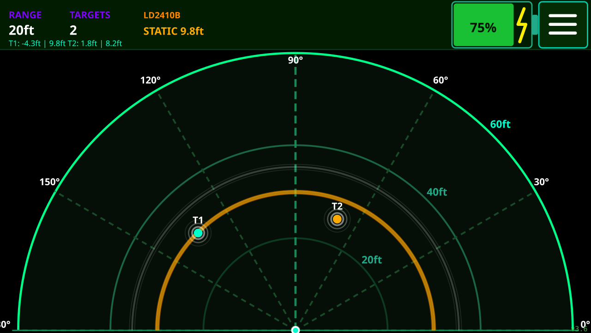

# LD2450 Tab5 Radar Visualizer

Real-time mmWave radar visualizer for the **M5Stack Tab5** using the **HLK-LD2450** 24 GHz presence sensor. Tracks up to three simultaneous targets, displays distance and position on a full-screen radar sweep, and provides an in-app settings menu.

The optional **HLK-LD2410B** adds micro-Doppler respiratory/micro-movement detection, catching stationary targets the LD2450 misses- a real-world equivalent of the beloved *Call of Duty: Black Ops* **Heartbeat Sensor**, down to the radar UI.



## Hardware

| Component | Notes |
|-----------|-------|
| M5Stack Tab5 | ESP32-P4 · 1280×720 MIPI-DSI · 32 MB PSRAM |
| HLK-LD2450 | 24 GHz mmWave radar, up to 3 moving targets, ~10 Hz output |
| HLK-LD2410B _(optional)_ | 24 GHz mmWave radar, single-target static presence detection |

### Wiring (GPIO_EXT header, bottom edge of Tab5)

| Tab5 pin | LD2450 | LD2410B |
|----------|--------|---------|
| EXT 5V   | VCC    | VCC     |
| GND      | GND    | GND     |
| G49      | TX     |         |
| G50      | RX     |         |
| G51      |        | TX      |
| G52      |        | RX      |

No level-shifter required — both sensors use 3.3 V UART logic even on a 5 V supply.

## Features

- Full 180° radar sweep with range rings at 2 m / 4 m / 6 m (displayed in imperial: ft / in)
- Expanding sonar-pulse animation with brightness fade
- Up to 3 colour-coded target dots (LD2450) with white glow and sweep-driven brightness
- **LD2410B static presence rings** — amber semicircle when a person stops moving (LD2450 blind spot), yellow when moving; distance shown in status bar
- Two-row status bar — range / target count / LD2410B state (row 1), per-target position readout (row 2)
- Battery indicator with live charging bolt, updated every second
- Settings menu:
  - IMU auto-rotate (uses Tab5 accelerometer)
  - Manual screen rotation (0° / 180°)
  - LD2450 config — single / multi-target tracking mode, factory reset
  - Sensor mount orientation — 2×2 grid (Standard / Direct / Rotate CW / Rotate CCW)

## Building

Requires the **M5Stack Arduino board package** (`m5stack:esp32` ≥ 3.3.7) and **M5Unified** library.

### Arduino IDE
Open `ld2450_tab5.ino`, select board **M5Stack Tab5**, compile and upload.

### arduino-cli
```bash
arduino-cli compile \
  --fqbn m5stack:esp32:m5stack_tab5 \
  --output-dir build \
  ld2450_tab5
```

### PlatformIO
`src/main.cpp` is a PlatformIO-compatible copy. Use `platformio.ini` at the project root.

## Flashing via M5Launcher (SD card)

1. Copy the desired `releases/ld2450_tab5_vX.X.bin` to the apps folder on the Tab5 SD card.
2. Boot into M5Launcher, select the file, and flash.

## Controls

| Action | Effect |
|--------|--------|
| Tap radar area | Cycle zoom range (2 m → 4 m → 6 m) |
| Tap ≡ (top-right) | Open / close settings menu |
| Tap outside open menu | Close menu |

## Releases

| Version | Notes |
|---------|-------|
| v3.6 | LD2410B dual-sensor support — static presence rings (amber/yellow), status bar LD2410B readout |
| v3.5 | Touch fix (`wasPressed`), degree symbol (UTF-8), 2×2 orientation grid, Standard/Direct orientation labels |
| v3.4 | Imperial units, full-height battery + menu button, white pulse, dotted sector lines, bold arc labels |

## License

MIT
